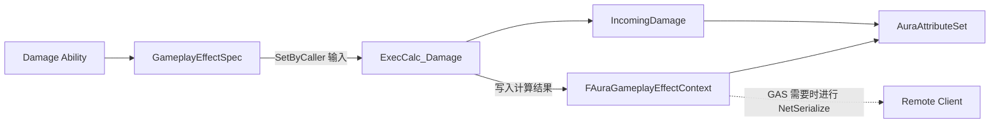

# GAS 自定义 GameplayEffectContext 与网络序列化学习笔记

> 对应项目：`E:\UE_Project\Aura`
> 核心文件：
>
> - `Source/Aura/Public/AuraAbilityTypes.h`
> - `Source/Aura/Private/AuraAbilityTypes.cpp`
> - `Source/Aura/Public/AbilitySystem/AuraAbilitySystemGlobals.h`
> - `Source/Aura/Private/AbilitySystem/AuraAbilitySystemGlobals.cpp`
> - `Config/DefaultGame.ini`

## 1. 先区分几个容易混淆的概念

### 1.1 复制（Replication）

复制是 Unreal 的网络同步机制：服务器决定哪些状态需要发给哪些客户端，以及什么时候发送。

例如 Actor 上带有 `Replicated` 的属性，会由 Actor Channel 根据网络相关性、更新频率等规则同步。

### 1.2 序列化（Serialization）

序列化解决的是：

> 已经决定要传输一个对象后，怎样把它转换成字节；接收端又怎样从字节恢复对象。

`FAuraGameplayEffectContext::NetSerialize()` 只负责数据的编码和解码。它不会主动创建网络连接，也不会保证每个 EffectContext 都会发送给所有客户端。

### 1.3 RPC

RPC 是一次网络函数调用，例如 Server RPC 或 Client RPC。它和 EffectContext 的 `NetSerialize` 不是一回事。

- RPC：发送一次函数调用及其参数。
- EffectContext NetSerialize：当 GAS 需要复制 Context 时，定义 Context 的网络数据格式。

### 1.4 UPROPERTY

`UPROPERTY()` 主要参与反射、编辑器、垃圾回收、保存加载和某些复制系统。

但在自定义 `NetSerialize()` 中：

> 字段是否写入网络包，取决于你的 `NetSerialize()` 代码，而不是它有没有 `UPROPERTY()`。

当前项目里的布尔值和浮点值带有 `UPROPERTY()`，但它们真正进入 EffectContext 网络包，是因为 `NetSerialize()` 显式处理了它们。

`DamageType` 是 `TSharedPtr<FGameplayTag>`，没有 `UPROPERTY()`。它的生命周期由共享指针管理，网络传输由手写的 `NetSerialize()` 管理。

---

## 2. 为什么 Debuff 信息适合放在 EffectContext

一次伤害事件包含两类数据：

### 输入参数

技能在创建 `GameplayEffectSpec` 时写入：

```text
Damage.Fire
Debuff.Chance
Debuff.Damage
Debuff.Duration
Debuff.Frequency
```

这些参数使用 `SetByCaller`，供 `ExecCalc_Damage` 读取。

### 计算结果

`ExecCalc_Damage` 经过抗性、概率、格挡和暴击计算后得到：

```text
bIsBlockedHit
bIsCriticalHit
bIsSuccessfulDebuff
DamageType
DebuffDamage
DebuffDuration
DebuffFrequency
```

这些结果需要继续传到 AttributeSet、GameplayCue 或客户端表现层。

`ExecCalc_Damage` 的局部变量在函数返回后会消失，因此需要一个和本次 GE 绑定的数据载体。EffectContext 正适合保存“这一次效果是由谁、因为什么、以什么命中结果发生”的上下文信息。

当前数据流：



重要区别：

- `SetByCaller` 是计算前的输入。
- EffectContext 中的 Debuff 字段是计算后的事件结果。

---

## 3. 自定义 Context 生效所需的完整链条

只定义 `FAuraGameplayEffectContext` 还不够。下面每一环都必须存在。

### 3.1 自定义结构体继承 FGameplayEffectContext

```cpp
USTRUCT(BlueprintType)
struct FAuraGameplayEffectContext : public FGameplayEffectContext
{
    GENERATED_BODY()
    // ...
};
```

基类已经保存了：

- Instigator
- EffectCauser
- Ability CDO
- SourceObject
- Actors
- HitResult
- WorldOrigin

Aura 在此基础上增加格挡、暴击和 Debuff 信息。

### 3.2 GetScriptStruct 返回真实结构体类型

```cpp
virtual UScriptStruct* GetScriptStruct() const override
{
    return StaticStruct();
}
```

EffectContext 经常通过基类指针流转。`GetScriptStruct()` 告诉 GAS：

> 这个基类指针实际指向的是 `FAuraGameplayEffectContext`。

如果返回了错误的结构体类型，复制、反序列化或类型判断可能按基类布局处理，新增字段也就无法可靠工作。

### 3.3 Traits 声明自定义序列化能力

```cpp
template<>
struct TStructOpsTypeTraits<FAuraGameplayEffectContext>
    : TStructOpsTypeTraitsBase2<FAuraGameplayEffectContext>
{
    enum
    {
        WithNetSerializer = true,
        WithCopy = true
    };
};
```

- `WithNetSerializer = true`：让引擎使用该结构体的 `NetSerialize()`。
- `WithCopy = true`：允许结构体参与 GAS 所需的复制操作。

遗漏 `WithNetSerializer` 时，即使函数写得完全正确，引擎也不会按预期调用它。

### 3.4 自定义 AbilitySystemGlobals 分配真实类型

```cpp
FGameplayEffectContext*
UAuraAbilitySystemGlobals::AllocGameplayEffectContext() const
{
    return new FAuraGameplayEffectContext();
}
```

所有通过 GAS 正常创建的 EffectContext，最终都应由这个工厂函数分配。

### 3.5 配置项目使用自定义 Globals

`Config/DefaultGame.ini`：

```ini
[/Script/GameplayAbilities.AbilitySystemGlobals]
AbilitySystemGlobalsClassName="/Script/Aura.AuraAbilitySystemGlobals"
```

如果缺少这项配置，GAS 仍会创建默认 `FGameplayEffectContext`。

此时下面这种转换就不再安全：

```cpp
static_cast<FAuraGameplayEffectContext*>(EffectContextHandle.Get())
```

因此排查自定义 Context 问题时，首先确认 Globals 配置是否真正加载。

---

## 4. EffectContextHandle 的共享语义

下面这段代码看上去复制了一个 Handle：

```cpp
FGameplayEffectContextHandle ContextHandle = Spec.GetContext();
```

但它并没有自动复制底层 Context。Handle 内部共享底层数据。

所以：

```cpp
SetIsSuccessfulDebuff(ContextHandle, true);
```

修改的是当前 Spec 正在使用的同一个 Context。

这也是 `DetermineDebuff()` 能通过局部 Handle 把数据传给 AttributeSet 的原因。

真正需要创建独立副本时，GAS 会用到 `Duplicate()`。

---

## 5. NetSerialize 的三个阶段

函数签名：

```cpp
bool FAuraGameplayEffectContext::NetSerialize(
    FArchive& Ar,
    UPackageMap* Map,
    bool& bOutSuccess)
```

### 5.1 参数职责

#### FArchive& Ar

`FArchive` 是统一的读写接口。

- `Ar.IsSaving()`：发送端正在写。
- `Ar.IsLoading()`：接收端正在读。

同一个函数同时描述编码和解码逻辑。

#### UPackageMap* Map

网络不能直接发送内存地址。`UPackageMap` 负责把 UObject 引用映射为网络可识别的 NetGUID，并在接收端恢复为本地对象引用。

复杂结构（例如 `FHitResult`）在 `NetSerialize` 时也需要它来处理内部可能存在的对象引用。

#### bool& bOutSuccess

用于向上层报告序列化是否成功。

它和函数返回值相关但职责不同：

- 返回值通常表示该结构支持并完成了序列化流程。
- `bOutSuccess` 表示具体字段的序列化是否成功。

### 5.2 Saving：先建立字段存在位

Aura 使用 `uint32 RepBits` 作为位掩码：

```cpp
uint32 RepBits = 0;
```

每个 bit 表示一个字段是否存在：

| Bit | 字段 |
|---:|---|
| 0 | Instigator |
| 1 | EffectCauser |
| 2 | AbilityCDO |
| 3 | SourceObject |
| 4 | Actors |
| 5 | HitResult |
| 6 | WorldOrigin |
| 7 | bIsBlockedHit |
| 8 | bIsCriticalHit |
| 9 | bIsSuccessfulDebuff |
| 10 | DebuffDamage |
| 11 | DebuffDuration |
| 12 | DebuffFrequency |
| 13 | DamageType |

设置 bit 的表达式：

```cpp
RepBits |= 1 << 10;
```

含义是：

1. `1 << 10` 生成只有第 10 位为 1 的数。
2. `|=` 把该位合并到原来的掩码中。

例如只有 Block、SuccessfulDebuff 和 DebuffDamage 有效：

```text
bit 10  bit 9  bit 8  bit 7
   1      1      0      1
```

接收端先拿到这个目录，就知道后面有哪些 payload。

### 5.3 发送位掩码

```cpp
Ar.SerializeBits(&RepBits, 14);
```

第二个参数是实际传输的位数，不是最高 bit 编号。

当前最高使用 `bit 13`，所以必须传 14 位：

```text
bit 0 ... bit 13 = 14 个 bit
```

如果错误地写成 13，`bit 13` 不会发送，接收端就不知道 DamageType payload 是否存在。

### 5.4 根据位掩码读写 payload

```cpp
if (RepBits & (1 << 10))
{
    Ar << DebuffDamage;
}
```

在发送端，`Ar << DebuffDamage` 写入浮点数。

在接收端，相同代码从 Archive 读取浮点数并写入本地字段。

关键规则：

> 发送端与接收端必须使用完全一致的 bit 定义、字段类型和 payload 顺序。

客户端和服务器通常运行同一版本代码，因此使用同一个函数。但如果网络协议发生变化，而两端版本不一致，就可能发生错位读取。

---

## 6. 为什么使用位掩码

如果无条件发送所有字段，需要发送：

- 所有对象引用
- Actors 数组
- HitResult
- WorldOrigin
- 三个 bool
- 三个 float
- DamageType

但绝大多数伤害可能：

- 没有格挡
- 没有暴击
- 没有 Debuff
- 没有 HitResult
- 没有额外 Actors

位掩码让空字段只消耗 1 bit，而不发送完整 payload。

例如没有成功 Debuff 时：

```cpp
bIsSuccessfulDebuff == false
DebuffDamage == 0
DebuffDuration == 0
DebuffFrequency == 0
DamageType invalid
```

bit 9 到 bit 13 都为 0，五项 payload 全部省略。

---

## 7. Bool 字段的两种编码方式

当前 Aura 实现对 bool 使用了“存在位 + bool payload”：

```cpp
if (bIsBlockedHit)
{
    RepBits |= 1 << 7;
}

if (RepBits & (1 << 7))
{
    Ar << bIsBlockedHit;
}
```

这能工作，但 bit 7 已经表示值为 true，因此后面的 bool payload 是重复信息。

更紧凑的方式是让存在位本身就是布尔值：

```cpp
if (Ar.IsLoading())
{
    bIsBlockedHit = (RepBits & (1 << 7)) != 0;
}
```

这样不需要额外 `Ar << bIsBlockedHit`。

注意：一旦修改网络格式，Saving 和 Loading 必须同时修改；不能只优化一边。

---

## 8. 对象引用、普通值和复杂结构如何序列化

### 8.1 UObject 引用

```cpp
Ar << Instigator;
Ar << EffectCauser;
Ar << SourceObject;
```

网络 Archive 会结合对象映射系统传输对象身份，而不是原始指针地址。

接收端只有在对应网络对象存在或可解析时，才能恢复有效引用。

### 8.2 普通值

```cpp
Ar << DebuffDamage;
Ar << DebuffDuration;
Ar << WorldOrigin;
```

这些类型已经提供 Archive 运算符。

### 8.3 数组

```cpp
SafeNetSerializeTArray_Default<31>(Ar, Actors);
```

使用 GAS/UE 提供的安全数组序列化 helper，并通过编译期边界限制异常大的数组。

网络数组一定要有数量上限，否则错误或恶意数据可能导致过量分配。

### 8.4 HitResult

`HitResult` 是共享指针。Loading 时本地还没有对象，因此必须先分配：

```cpp
if (Ar.IsLoading() && !HitResult.IsValid())
{
    HitResult = MakeShared<FHitResult>();
}

HitResult->NetSerialize(Ar, Map, bOutSuccess);
```

### 8.5 GameplayTag

DamageType 使用同样模式：

```cpp
if (Ar.IsLoading() && !DamageType.IsValid())
{
    DamageType = MakeShared<FGameplayTag>();
}

DamageType->NetSerialize(Ar, Map, bOutSuccess);
```

不能在空共享指针上调用 `->NetSerialize()`，否则会崩溃。

Library 的 `GetDamageType()` 对外返回普通 `FGameplayTag`，隐藏共享指针细节：

```cpp
if (DamageType.IsValid())
{
    return *DamageType;
}

return FGameplayTag();
```

---

## 9. Duplicate 与 NetSerialize 解决的是不同问题

### NetSerialize

解决跨机器的数据传输：

```text
Server Context -> bytes -> Client Context
```

### Duplicate

解决同一进程中的独立复制：

```text
Original Context -> Independent Context Copy
```

仅执行：

```cpp
*NewContext = *this;
```

会浅拷贝共享指针。新旧 Context 可能共享同一个 `HitResult` 或 `DamageType`。

当前代码进一步深拷贝：

```cpp
NewContext->AddHitResult(*GetHitResult(), true);
NewContext->DamageType = MakeShared<FGameplayTag>(*DamageType);
```

这样修改副本时不会意外影响原 Context。

---

## 10. 为什么 Loading 后要调用 AddInstigator

当前实现最后执行：

```cpp
if (Ar.IsLoading())
{
    AddInstigator(Instigator.Get(), EffectCauser.Get());
}
```

反序列化把 `Instigator` 和 `EffectCauser` 字段恢复了，但基类内部还可能维护由它们派生出的缓存，例如 Instigator 对应的 AbilitySystemComponent。

再次调用 `AddInstigator()` 是为了让这些内部缓存与刚读取的引用保持一致。

只恢复裸字段而不恢复派生缓存，可能出现：

```text
GetInstigator() 有值
GetInstigatorAbilitySystemComponent() 却为空
```

---

## 11. bOutSuccess 的注意事项

当前代码中，`HitResult` 和 `DamageType` 的 `NetSerialize()` 都会修改 `bOutSuccess`，但函数末尾又执行：

```cpp
bOutSuccess = true;
return true;
```

这会覆盖嵌套字段可能报告的失败。

更严谨的模式是累计成功状态，例如：

```cpp
bool bLocalSuccess = true;

bLocalSuccess &= HitResult->NetSerialize(Ar, Map, bFieldSuccess);
bLocalSuccess &= bFieldSuccess;

bOutSuccess = bLocalSuccess;
return true;
```

或者在任一关键字段失败时立即设置 `bOutSuccess = false`。

当前项目代码已经能够编译和运行，但这是进一步提高健壮性时值得处理的点。

---

## 12. 网络协议修改规则

自定义 `NetSerialize()` 本质上定义了一份网络协议。

以后增加字段时应遵循：

1. 给新字段分配唯一 bit。
2. 增大 `SerializeBits()` 的位数。
3. Saving 端设置存在位。
4. payload 分支同时支持 Saving 和 Loading。
5. Loading 前为指针类型准备存储对象。
6. 保证服务端和客户端字段类型、bit 和顺序一致。
7. 为缺失字段保留明确默认值。
8. 如果需要支持不同版本客户端，增加显式协议版本，而不是直接重排旧 bit。

推荐只在末尾追加新 bit，不随意改变旧字段的 bit 编号。

---

## 13. 当前 Debuff 数据的端到端过程

### 13.1 创建 Spec

`UAuraAbilitySystemLibrary::ApplyDamageEffect()`：

```text
DamageType -> BaseDamage
Debuff.Chance -> DebuffChance
Debuff.Damage -> DebuffDamage
Debuff.Duration -> DebuffDuration
Debuff.Frequency -> DebuffFrequency
```

### 13.2 ExecCalc 判定

`DetermineDebuff()`：

```text
读取 DamageType
查找对应抗性
计算 EffectiveDebuffChance
随机判定
```

### 13.3 写入 Context

成功时：

```cpp
SetIsSuccessfulDebuff(ContextHandle, true);
SetDamageType(ContextHandle, DamageType);
SetDebuffDamage(ContextHandle, DebuffDamage);
SetDebuffDuration(ContextHandle, DebuffDuration);
SetDebuffFrequency(ContextHandle, DebuffFrequency);
```

### 13.4 AttributeSet 读取

`HandleIncomingDamage()`：

```cpp
if (IsSuccessfulDebuff(Props.EffectContextHandle))
{
    Debuff(Props);
}
```

下一步会在 `Debuff()` 中读取 Context，动态创建带 Duration 和 Period 的 GameplayEffect。

---

## 14. 常见错误排查表

| 现象 | 常见原因 | 检查位置 |
|---|---|---|
| Context 始终是基类 | 自定义 Globals 未配置 | `DefaultGame.ini` |
| 自定义字段本地正常、客户端为空 | Traits 未启用或字段没写进 NetSerialize | `TStructOpsTypeTraits`、`NetSerialize()` |
| DamageType 客户端崩溃 | Loading 时没有创建共享对象 | bit 13 分支 |
| 后续字段读成错误数值 | 两端 payload 顺序或类型不一致 | 所有 bit 分支 |
| bit 13 永远不生效 | `SerializeBits` 错写成 13 | 应为 14 |
| Instigator 有值但 ASC 为空 | Loading 后没有调用 `AddInstigator` | NetSerialize 尾部 |
| Duplicate 后改副本影响原值 | 共享指针只做了浅拷贝 | `Duplicate()` |
| static_cast 后出现未定义行为 | 实际 Context 不是 Aura 类型 | Globals 配置、`GetScriptStruct()` |
| 无 Debuff 时仍发送大量数据 | 没有使用存在位过滤默认值 | Saving 阶段的 RepBits |
| 嵌套字段失败却显示成功 | 结尾无条件把 `bOutSuccess` 设为 true | NetSerialize 尾部 |

---

## 15. 调试建议

### 确认实际 Context 类型

```cpp
const FGameplayEffectContext* Context = EffectContextHandle.Get();
UE_LOG(LogTemp, Warning, TEXT("Context type: %s"),
    *GetNameSafe(Context ? Context->GetScriptStruct() : nullptr));
```

预期应看到 `AuraGameplayEffectContext`，而不是默认基类。

### 在 Saving 和 Loading 两端记录 RepBits

```cpp
UE_LOG(LogTemp, Warning, TEXT("NetSerialize %s RepBits=%u"),
    Ar.IsSaving() ? TEXT("Saving") : TEXT("Loading"),
    RepBits);
```

注意不要长期保留高频日志，否则持续效果会产生大量输出。

### 验证同一字段的完整链路

以 `DebuffDamage` 为例：

```text
FDamageEffectParams.DebuffDamage
  -> SetByCaller Debuff.Damage
  -> ExecCalc GetSetByCallerMagnitude
  -> EffectContext.SetDebuffDamage
  -> NetSerialize bit10
  -> AttributeSet GetDebuffDamage
```

逐段验证比只在最终 AttributeSet 打断点更容易定位问题。

---

## 16. 一句话记忆

> Replication 决定“要不要发”，NetSerialize 决定“怎么发”；RepBits 是字段目录，payload 是字段内容；自定义 EffectContext 要同时打通类型分配、类型识别、复制语义和网络协议。
